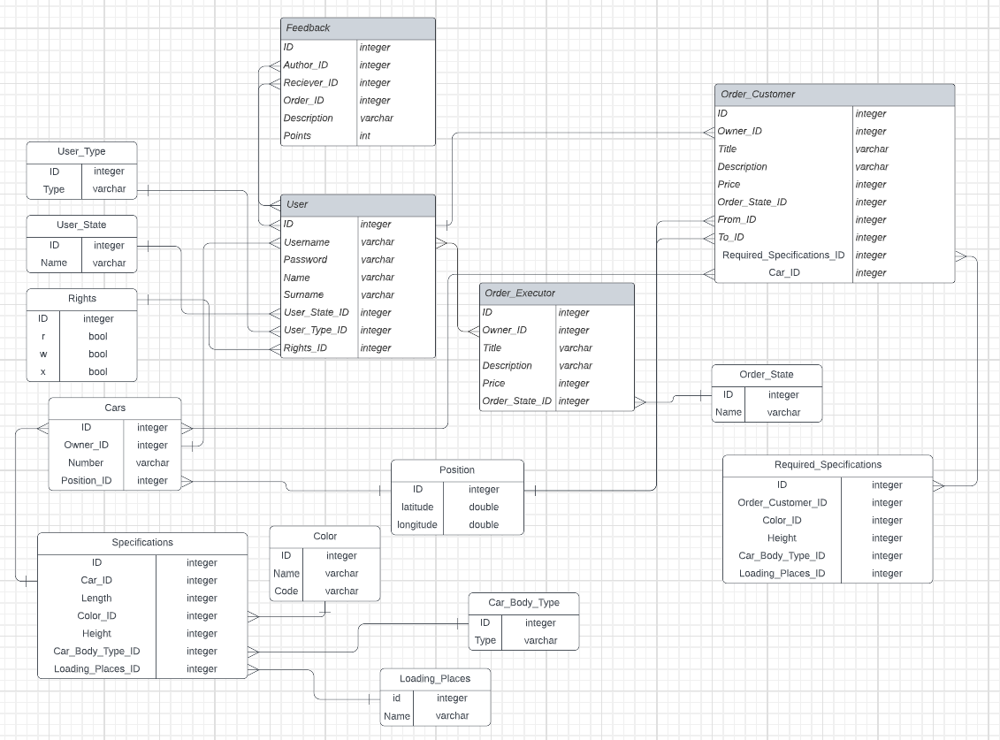

# logistics-aggregator

Информационная система представляет из себя агрегатор логистических заказов, основная задача которой исключить лишнее 
посредничество, оптимизировать маршруты (по прибыли/скорости/расстоянию) для исполнителей и оптимизировать доставку 
(по стоимости/времени/расстоянию) для заказчиков.

Информационная система должна:
- обеспечивать хранение и обработку данных о логистических заказах
- организовывать прямое взаимодействие владельцев грузов и транспортных компаний.
- позволять выставлять заказчикам объявления о перевозке груза из пункта А в пункт Б, назначать стоимость за успешное 
выполнение, назначать сроки исполнения заказа
- позволять исполнителям заказов вносить данные о своих автомобилях в профиль исполнителя
- позволять исполнителям выставлять объявления о возможности исполнения заказа о перевозе груза из пункта А в пункт Б 
(или назначить тарификацию), назначить стоимость услуги и привязать к объявлению тип автомобиля или автомобиль 
(чтобы понимать допустимые нормативы на перевозку)
- предоставлять возможность оставлять отзывы как заказчикам об исполнителях, так и исполнителям о заказчиках
- вести историю завершенных заказов для исполнителей и заказчиков
- предоставлять возможность оптимизировать заказ для исполнителя и заказчика по различным критериям
- предоставить возможность администрирования для решения конфликтов между заказчиками и исполнителями
- предоставить возможность отслеживания автомобиля исполняющего заказ как исполнителю, так и заказчику

## Описание и правила
**Заказчик** — пользователь, который может выставлять заказы и принимать объявления исполнителей о возможности перевоза 
груза. При размещении заказа заказчик должен указать требуемые габариты для груза, сроки доставки, информацию по 
поводу оплаты заказа и требования по поводу транспортировки груза.

**Исполнитель** — пользователь, который может выставлять объявления о перевозках и принимать выставленные заказы. 
Исполнитель должен указать свои автомобили (и их характеристики) в профиле и подтвердить корректность информации.
К каждому исполняемому заказу в один и тот же отрезок времени привязывается один автомобиль, который исполняет данный 
заказ. Информация о географическом положении автомобиля может отслеживаться как заказчиком, так и исполнителем.
Если свободный автомобиль исполнителя не соответствует требованиям перевозки, то он не может принять к исполнению заказ.

**Администратор** — пользователь, обязанностью которого является решение конфликтных ситуаций, возникающих между 
исполнителем и заказчиком. На различные свои действия администратор должен писать отчет в системе.

### Бизнес-процессы
Пользователь — **заказчик**. Возможности:
- создать заказ и задать его параметры
- выбрать подходящее объявление исполнителя и отдать заказ
- оставить отзыв об исполнителе

Пользователь — **исполнитель**. Возможности:
- создать объявление о возможности выполнить заказ и задать его параметры
- выбрать подходящий заказ и начать его исполнение
- оставить отзыв о заказчике

Пользователь — **администратор**. Возможности
- блокировать пользователей заказчик и исполнитель
- удалять объявления о заказах
- удалять отзывы об исполнителях и о заказчиках

## Даталогическая модель базы данных
